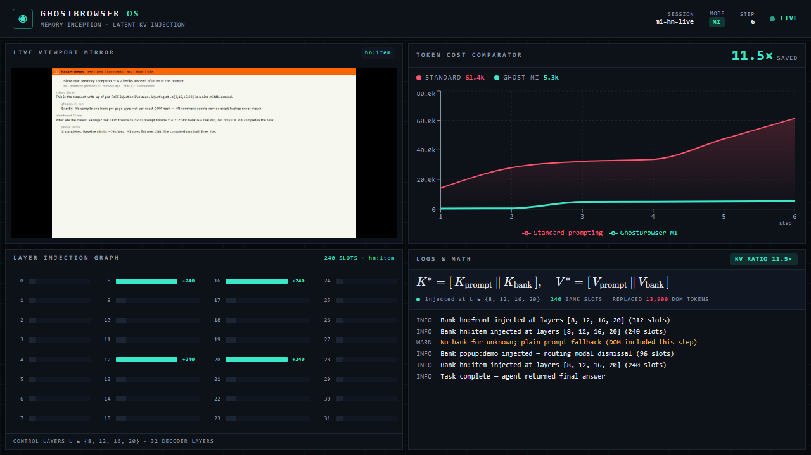

# P4 — Web console against the real run

Status of the console after P4. Branch `phase2/p4-console-live`; write scope was
`apps/web-console/` + `docs/handoff/phase-2/notes/`.



## What was done

- **Schema audit (CONTRACTS §7).** Reducer now consumes every field the engine
  emits. `token_metrics.baseline_tokens` / `visible_tokens` were being dropped;
  they are now tracked (`domTokenCount`, `visibleTokens`) and surfaced.
- **Logs & Math panel** shows the **real** `num_slots` and DOM token count
  (`240 BANK SLOTS · REPLACED 13,900 DOM TOKENS`) next to the K*/V* equation —
  satisfies task 5 (equation reflects real `num_slots` / `dom_token_count`).
- **Viewport panel** decouples the painted frame from the prop via a single
  `requestAnimationFrame`, so bursts of real ~300 ms JPEG frames coalesce to the
  newest one (no lag/leak over a multi-minute run). Crimson popup cue already
  wired to the real `popup:demo` `layer_injection`.
- **Token comparator** legibility bumped for projector (larger ratio readout,
  thicker MI line, larger axis/legend type). Two diverging series + animated
  `kv_savings_ratio` confirmed against real cumulative data.
- **Resilience.** Added a clear **RECONNECTING** banner (`reconnect-banner`) so a
  mid-demo engine restart never looks like a frozen panel; accumulated state is
  preserved across the reconnect.
- **Reproducible e2e.** `e2e/fixtures/real-run.json` is a recorded full HN
  mi-mode run (CONTRACTS §7, real Chromium-rendered viewport frames). The new
  Playwright tests replay it for (a) a full populated-run + demo screenshot and
  (b) an engine-restart/reconnect — both green in CI with **no GPU**.
- **Screenshot** committed at `p4-console-shot.png` (captured by the e2e run).

## How to verify

```bash
cd apps/web-console
pnpm test        # 12 unit tests (reducer + reconnect)
pnpm test:e2e    # 3 e2e: smoke, full recorded run + screenshot, engine restart
pnpm build       # production build (lint + types clean)
node e2e/fixtures/generate-fixture.mjs   # regenerate fixture + frames
```

## Remaining (needs P1's live engine — the only mock→real swap)

The console is already pointed at `NEXT_PUBLIC_INFERENCE_WS`; for the live demo
set it to `ws://<p1-box>:8000/ws/events` and drive a real P3 `mi` session. The
event schema is verified field-for-field against §7, so no reducer change is
expected — if the real engine drifts, fix it in `lib/eventReducer.ts` only.

Values in the recorded fixture (final ratio 11.5×, including one honest
`unknown`-page fallback step) are illustrative; the live run supplies the real
numbers.
